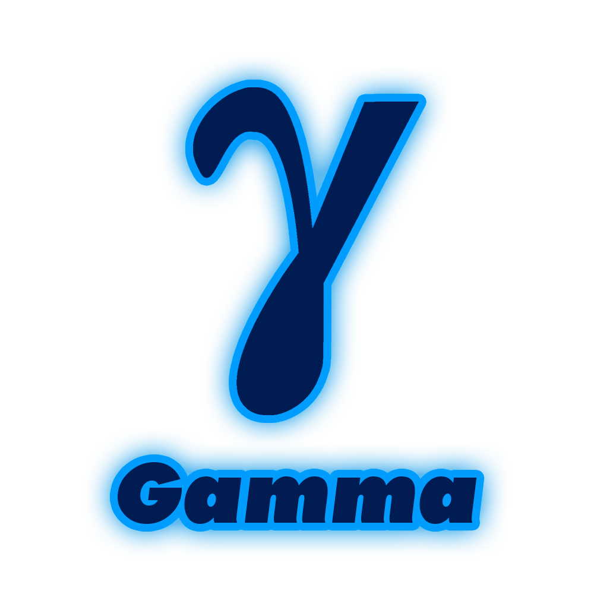

<p align="center">
 <br>
Gamma - lambda calculus interpreter.
</p>

## What is λ-calculus?
> λ-calculus is a formal system in mathematical logic and computer science for expressing computation by way of variable binding and substitution. It captures the features of a wide variety of programming languages.

Imagine if only functions exists. That is lambda calculus. 

As long as functions can be represented as machines that convert input to output, in lambda calculus functions transform functions into another functions.

And fun fact: it is turing complete and is base for almost every functional programming language.

## Example
Boolean logic implemented in Gamma:
```ocaml
let true = \x => \y => x;
let false = \x => \y => y;

let not = \b => b true false;

let and = \a => \b => a b a;
let or = \a => \b => a a b;
```

## Tutorials

[Boolean logic](tutorials/booleans.md)

[Working with numbers](tutorials/numbers.md)

[Implementing recursion](tutorials/recursion.md)

## Syntax

```ebnf
<program>           ::= <statement>*
<statement>         ::= (<let> | <expression>) ";"
<let>               ::= "let" identifier "=" <expression>
<expression>        ::= <abstraction>
                      | identifier
                      | "(" <expression> ")"
                      | <application>
<application>       ::= <function> <argument>
<function>          ::= <application>
                      | identifier
                      | "(" <expression> ")"
<argument>          ::= identifier
                      | "(" <expression> ")"
<abstraction_sep>   ::= "=>" | "."
<abstraction>       ::= lambda identifier <abstraction_sep> <expression>
```

## Building
As long as Gamma is written in Rust, you need to install cargo and rust compiler toolchain. Then clone the repository:
```
git clone https://github.com/vertexgmd/gamma
```
After that go into `gamma/` folder and run cargo build:
```
cargo build --release
```
Have fun!
